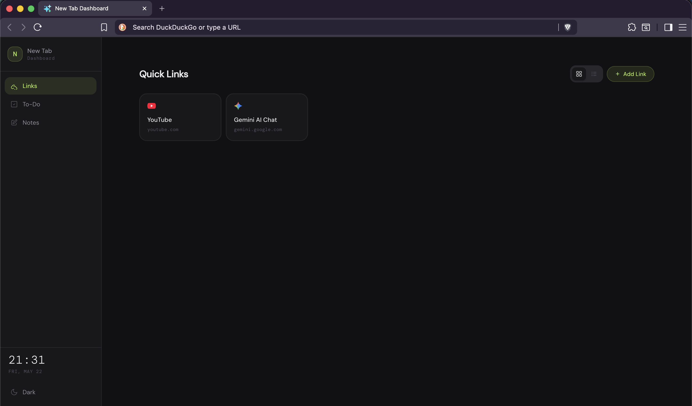
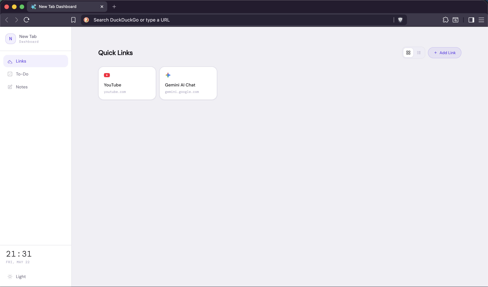

# New Tab Dashboard

A lightweight, distraction-free Chrome extension that transforms your default "New Tab" page into a sleek, personal productivity hub. Designed to help you stay organized, focused, and efficient every time you open a new tab.

## Screenshots

<table align="center">
    <tr>
        <td align="center">
            
        </td>
        <td align="center">
            
        </td>
    </tr>
    <tr>
        <td>Dark Mode</td>
        <td>Light Mode</td>
    </tr>
</table>

## Features

*   **Link Saver:** Bookmark and organize your favorite or frequently visited websites for quick access.
*   **Quick Notes:** Jot down ideas, thoughts, or scratchpad text instantly without leaving your tab.
*   **To-Do List:** Manage daily tasks, track progress, and check off items to stay on top of your workflow.
*   **Clean UI:** Minimalist and modern design crafted to reduce clutter and cognitive overload.

## Built With

*   HTML5
*   CSS3
*   JavaScript
*   Chrome Extension APIs (`storage` for saving data locally)

## Installation & Getting Started

1.  **Clone the repository:**
```bash
git clone https://github.com/arquizade/new-tab-dashboard.git
```
2.  Open Google Chrome and navigate to `chrome://extensions/`.
3.  Enable **Developer mode** (toggle switch in the top right corner).
4.  Click on **Load unpacked** in the top left corner.
5.  Select the project folder where `manifest.json` is located.
6.  Open a new tab and enjoy your new dashboard!

## Security & Privacy Notice

> **Important:** Please be mindful of the information you store in this dashboard. 

* **Not an Encrypted Vault:** This extension is designed for quick notes, daily to-dos, and browser bookmarks. It **does not** encrypt data and is not a secure password manager or credential vault. 
* **Sensitive Data:** Avoid storing sensitive or highly private information—such as passwords, credit card numbers, or API keys—in the text fields.
* **Local Storage:** All data is saved directly to your local browser storage (`chrome.storage.local`). Your information never leaves your computer or passes through external servers, but anyone with physical access to your logged-in browser can see your dashboard.
